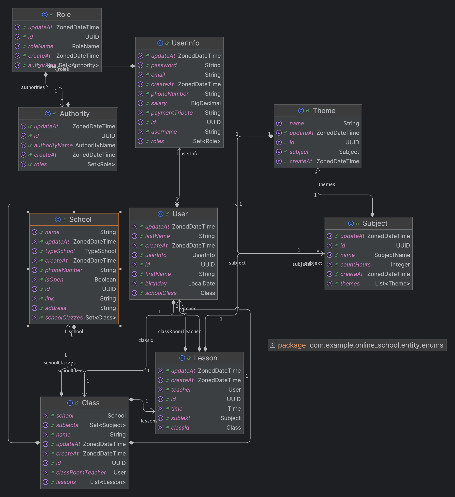
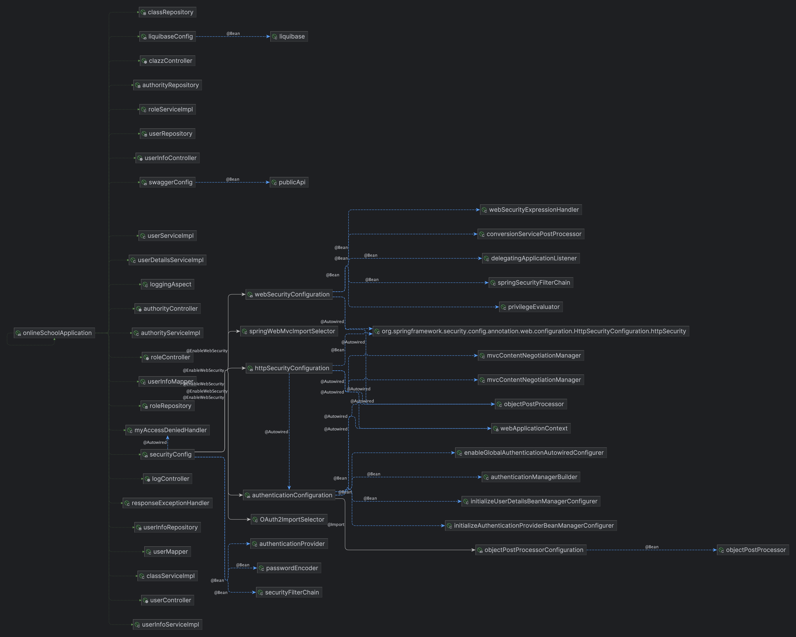
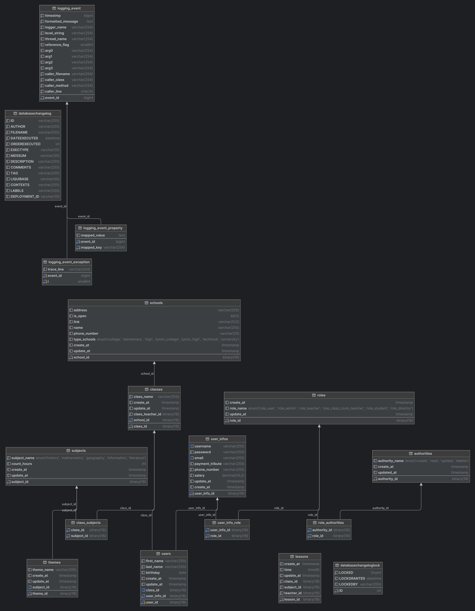

# Online School[Backend]

There is a prototype data of the main services BackEnd online school.
The data consists of users, user infos, roles, user info-role, authorities, role-authorities, classes, subjects,
lessons, themes.

###  Diagram OnlineSchoolApplication



### Bean Diagram OnlineSchoolApplication



### Database Diagram




###  Clone the repository

```
git@github.com:Tiupina-Liubov/OnlineSchool.git
```
---

### Used technology stack in my web application:

- Java 17
- Spring Framework
- Spring Security
- MySQL
- JPA
- Mapstruct
- Jacoco

---

- Jupiter - Testing
- Maven
- SLF4J
- Logback

___

## Database Structure

### Table user (users table)

| Column name  | Type         | Description                                   |
|--------------|--------------|-----------------------------------------------|
| user_id      | binary(16)   | id key of row - unique, not null, primary key | 
| first_name   | varchar(255) | users name , not null                         | 
| last_name    | varchar(255) | users  surname, not null                      |
| birthday     | data         | users birthday                                |
| class_id     | binary(16)   | default null                                  |
| user_info_id | binary(16)   | id key of row - unique, not null, primary key |
| created_at   | timestamp    | timestamp of row creation , not null          |
| updated_at   | timestamp    | timestamp of last update                      | 

### Table user info ( user_infos table )

| Column name     | Type          | Description                                      |
|-----------------|---------------|--------------------------------------------------|
| user_info_id    | binary(16)    | id key of entity - unique, not null, primary key |
| username        | varchar(255)  | username , not null                              |
| email           | varchar(255)  | user email, not null                             |
| password        | varchar(255)  | user password, not null                          |
| payment_tribute | varchar(255)  | default null                                     |
| phone_number    | varchar(255)  | user phone number                                |
| salary          | decimal(38,2) | default null                                     |
| created_at      | timestamp     | timestamp of row creation                        |
| updated_at      | timestamp     | timestamp of last update                         |

### Table roles ( roles table )

| Column name | Type       | Description                                      |
|-------------|------------|--------------------------------------------------|
| role_id     | binary(16) | id key of entity - unique, not null, primary key |
| role_name   | enum       | authority name , not null                        | 
| created_at  | timestamp  | timestamp of row creation                        |
| updated_at  | timestamp  | timestamp of last update                         |

### Table user info - roles (user_info_roles table)

| Column name  | Type       | Description                                      |
|--------------|------------|--------------------------------------------------|
| user_info_id | binary(16) | id key of entity - unique, not null, primary key |
| role_id      | binary(16) | id key of entity - unique, not null, primary key |

### Table authorities ( authorities table )

| Column name    | Type       | Description                                      |
|----------------|------------|--------------------------------------------------|
| authority_id   | binary(16) | id key of entity - unique, not null, primary key |
| authority_name | enum       | authority name , not null                        | 
| created_at     | timestamp  | timestamp of row creation                        |
| updated_at     | timestamp  | timestamp of last update                         |

### Table role - authorities (role_authorities table)

| Column name  | Type       | Description                                      |
|--------------|------------|--------------------------------------------------|
| user_info_id | binary(16) | id key of entity - unique, not null, primary key |
| role_id      | binary(16) | id key of entity - unique, not null, primary key |

### Table classes ( classes table )

| Column name    | Type       | Description                                      |
|----------------|------------|--------------------------------------------------|
| authority_id   | binary(16) | id key of entity - unique, not null, primary key |
| authority_name | enum       | authority name , not null                        | 
| created_at     | timestamp  | timestamp of row creation                        |
| updated_at     | timestamp  | timestamp of last update                         |

### Table lessons ( lessons table )

| Column name | Type       | Description                                      |
|-------------|------------|--------------------------------------------------|
| lesson_id   | binary(16) | id key of entity - unique, not null, primary key |
| time        | time(6)    | lecture start time , default null                |
| created_at  | timestamp  | timestamp of row creation                        |
| updated_at  | timestamp  | timestamp of last update                         |
| subject_id  | enum       | subject of this lecture                          |
| teacher_id  | binary(16) | teacher of this lecture                          |
| class_id    | binary(16) | class of this lecture                            |

### Table subject ( subjects tablet )

| Column name  | Type       | Description                                      |
|--------------|------------|--------------------------------------------------|
| subject_id   | binary(16) | id key of entity - unique, not null, primary key |
| subject_name | enum       | authority name , not null                        |
| created_at   | timestamp  | timestamp of row creation                        |
| updated_at   | timestamp  | timestamp of last update                         |
| count_hours  | integer    | number of hours of subject                       |

### Table school ( schools table )

| Column name  | Type         | Description                                                      |
|--------------|--------------|------------------------------------------------------------------|
| school_id    | binary(16)   | id key of entity - unique, not null, primary key                 |
| address      | varchar(255) | authority name , not null                                        |
| is_open      | BIT(1)       | Flag indicating if the school is open (1 for open, 0 for closed) |
| link         | varchar(255) | Website link or profile of the school                            |
| name         | varchar(255) | Name of the school                                               |
| phone_number | varchar(25)  | Contact phone number of the school                               |
| type_schools | enum         | Type of school (values constrained by enumeration)               |
| created_at   | timestamp    | timestamp of row creation                                        |
| updated_at   | timestamp    | timestamp of last update                                         |

### Table class subject ( class_subjects table )

| Column name | Type       | Description                                      |
|-------------|------------|--------------------------------------------------|
| class_id    | binary(16) | id key of entity - unique, not null, primary key |
| subject_id  | binary(16) | id key of entity - unique, not null, primary key |
